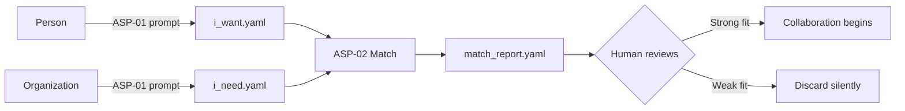

# Activity Specification Protocol (ASP)

**You are what you do. The specification IS the identity.**

A YAML-based standard for machine-readable professional profiles. Describes what people **do** (not who they are) and what organizations **need** (not what job title they're hiring for).

Specifications are LLM-generated, git-tracked, and LLM-matched.

---

## The Problem

Traditional profiles collapse multi-dimensional activity into single-line summaries. Two "Brand Strategists" with structurally different work appear identical on LinkedIn. Two research programs with perfect complementarity never find each other because one is tagged "marketing" and the other "measurement theory."

The collapse destroys the information that matching requires.

## The Solution

**Specify before you summarize.** Publish the full-dimensional specification. Let each observer collapse according to their own needs:

- A journal editor reads `publications` + `active_work`
- A podcast host reads `origin` + `positioning`
- A collaborator reads `active_work.need` + `collaboration`
- An AI agent parses the entire YAML in milliseconds

One specification. Multiple renderings. Each observer assembles a different profile from the same source — the same way different people perceive the same brand differently.

## How It Works

```
1. GENERATE:  Person + LLM conversation  -->  i_want.yaml
2. STORE:     i_want.yaml                -->  git repo (versioned, diffable)
3. MATCH:     i_want.yaml + i_need.yaml  -->  match_report.yaml
```



## Quick Start

1. Copy the [ASP-01 generation prompt](prompts/ASP_01_GENERATE.md) into any LLM (Claude, GPT, Gemini)
2. Have a conversation about what your work produces
3. The LLM outputs a structured `i_want.yaml`
4. Commit it to a git repo — your activity specification now has version history
5. When you receive someone else's spec, use [ASP-02](prompts/ASP_02_MATCH.md) to evaluate fit

## Example: Claude Shannon, December 1946

Shannon is 30. He's at Bell Labs. His wartime cryptography work is classified. "A Mathematical Theory of Communication" doesn't exist yet — it will be published in 1948. Here's what his activity specification would have looked like:

```yaml
meta:
  spec_type: "i_want"
  spec_date: "1946-12-01"
  context:
    situation: >
      Post-WWII Bell Labs. Returned from classified cryptography work.
      Boolean algebra thesis (1937) established the method: find abstract
      mathematical structure inside concrete engineering problems.
    what_comes_next: "A general theory of communication"

activity:
  one_line: >
    Formalizing the mathematical structure of communication — what can
    be transmitted, how much, and what is lost
  method: >
    Mathematical abstraction from engineering problems. Strip away
    physical implementation and semantic content. Keep the structure.

intellectual_priors:
  - author: "George Boole"
    work: "An Investigation of the Laws of Thought"
    contribution: "Symbolic logic — the foundation for treating circuits as algebra"
  - author: "Harry Nyquist"
    work: "Certain Factors Affecting Telegraph Speed"
    contribution: "Signal transmission rate limits — the engineering problem to formalize"
  - author: "Ralph Hartley"
    work: "Transmission of Information"
    contribution: "Logarithmic information measure — the seed of the entropy formula"

active_work:
  - topic: "General mathematical theory of communication"
    status: "seeking"
    need: >
      A framework for quantifying information content of signals
      independently of their meaning — and a publication venue that
      reaches both mathematicians and engineers
```

Meanwhile, Bell Labs' `i_need` spec describes exactly this gap: "Mathematical foundations for the next generation of communication systems." The match report scores `complementarity: high` across every axis.

**The hindsight**: Shannon published "A Mathematical Theory of Communication" in the Bell System Technical Journal, July/October 1948. It created information theory and became one of the most cited papers in history.

The specification made the match visible before the breakthrough happened.

## Historical Demos

Five pairs of specifications from the history of science and engineering. Each `i_want` is dated BEFORE the person's breakthrough. Each `i_need` is the organization or field that matched them. The reader knows (with hindsight) what happened next.

| Person | Date | "I Want" | "I Need" | What Happened Next |
|--------|------|----------|----------|-------------------|
| **Claude Shannon** | Dec 1946 | Formalizing communication theory | Bell Labs: channel capacity foundations | Information theory (1948) |
| **Gustav Fechner** | Feb 1855 | Measuring subjective perception | The field of psychophysics (didn't exist yet) | *Elemente der Psychophysik* (1860) |
| **W. Edwards Deming** | Apr 1947 | Statistical quality at management level | SCAP Japan: industrial reconstruction | Japanese quality revolution (1950s) |
| **Herbert Simon** | Sep 1952 | Formal models of bounded rationality | RAND + Carnegie: behavioral science | Nobel Prize in Economics (1978) |
| **Taiichi Ohno** | Oct 1948 | Pull-based production flow | Toyota: efficiency without volume | Toyota Production System (1948-1975) |

Each pair includes a full [match report](examples/match_reports/) showing the ASP-02 compatibility analysis with hindsight verdicts.

## Two Specification Types

### "I Want" (Person Seeking Engagement)

What the person does, how they do it, what they've built, and what they need. Activity-first, verb-first. Credentials come last.

Key matchable field: `active_work.need` — what is missing.

Schema: [`schema/i_want.yaml`](schema/i_want.yaml)

### "I Need" (Organization Seeking Capability)

What capability is missing, what the project requires, and what the organization offers. Capability-first, not title-first.

Key matchable field: `active_problems.what_is_missing` — the gap.

Schema: [`schema/i_need.yaml`](schema/i_need.yaml)

### Match Report

Structured compatibility analysis across five dimensions: complementarity, method compatibility, intellectual alignment, positioning, and recommendation.

Schema: [`schema/match_report.yaml`](schema/match_report.yaml)

## Repository Structure

```
activity-spec/
  schema/
    i_want.yaml                     # Person specification schema
    i_need.yaml                     # Opportunity specification schema
    match_report.yaml               # Compatibility report schema
  prompts/
    ASP_01_GENERATE.md              # LLM prompt: conversation -> YAML
    ASP_02_MATCH.md                 # LLM prompt: two specs -> report
  examples/
    i_want/                         # 5 historical person specs
    i_need/                         # 5 matching opportunity specs
    match_reports/                  # 5 compatibility reports
  docs/
    DISTRIBUTION_ARCHITECTURE.md    # How ASP scales (RSS/pull model)
    HISTORICAL_NOTES.md             # Sources for historical accuracy
```

## Distribution: How Specs Find Each Other

ASP is designed for decentralized, AI-agent-mediated matching. No platform required.

- **Publish** your spec on your own domain or git repo
- **Discover** others' specs via direct URLs, llms.txt references, or thin registries
- **Match** using your AI agent — it monitors opportunity feeds, runs ASP-02, and alerts you only for strong matches

The agent does the filtering. The specifications preserve the full dimensionality. The human does the judgment.

Full architecture: [`docs/DISTRIBUTION_ARCHITECTURE.md`](docs/DISTRIBUTION_ARCHITECTURE.md)

## Origin

ASP grew out of research on multi-dimensional specification systems:

- [Spectral Brand Theory](https://spectralbranding.com) — decomposes brand perception into 8 measurable dimensions
- [Organizational Schema Theory](https://orgschema.com) — specifies businesses backward from customer experience goals

The core insight transfers: traditional summaries (brand scores, CVs, job postings) collapse multi-dimensional profiles into single metrics, losing the structural information that matching requires. ASP applies the same "specify before you collapse" principle to professional identity.

## License

MIT. See [LICENSE](LICENSE).

## Author

Dmitry Zharnikov ([ORCID](https://orcid.org/0009-0000-6893-9231))

## Citation

See [CITATION.cff](CITATION.cff) for structured citation data.
